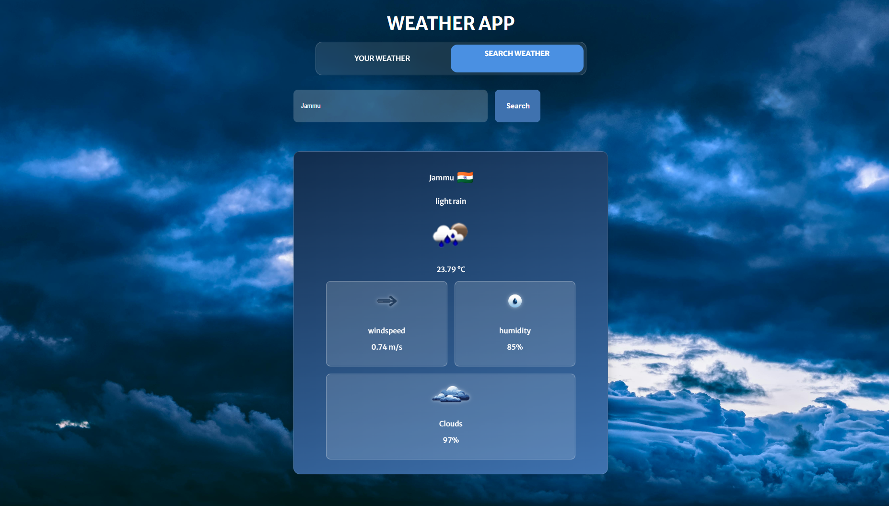

# 🌦️ Weather App

A modern, responsive weather application built using HTML, CSS, and JavaScript. It fetches real-time weather data using the OpenWeatherMap API and supports location-based as well as city-based search.

---

## 🚀 Features

- 📍 Get weather for your current location
- 🔍 Search weather by city name
- 🌤️ View temperature, humidity, cloudiness, and wind speed
- ⚡ Real-time data from OpenWeatherMap API
- 📱 Fully responsive and mobile-friendly design
- 🧭 Error handling for location permissions and network issues

---

## 📸 Preview



---

## 🛠️ Tech Stack

- HTML5
- CSS3 (Glassmorphism + Responsive)
- JavaScript (ES6)
- OpenWeatherMap API

---

## 🔑 Setup Instructions

1. **Clone the repository**:
   ```bash
   git clone https://github.com/yourusername/weather-app.git
   cd weather-app
